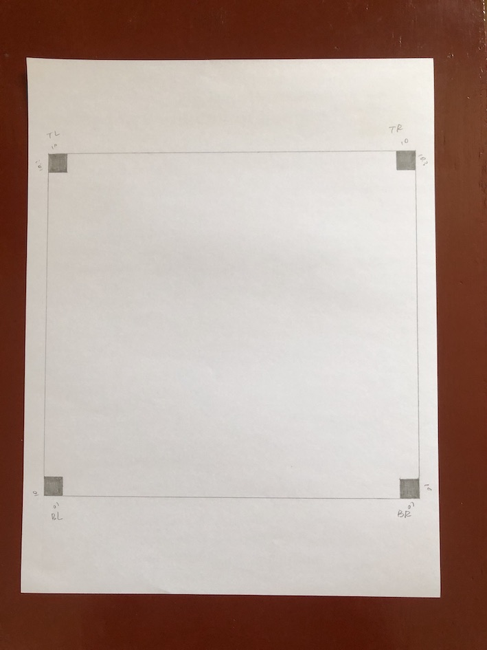
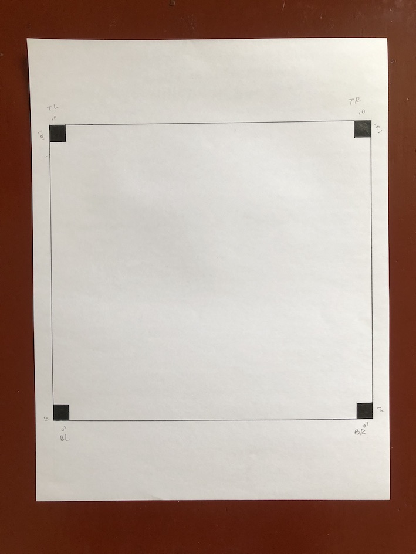
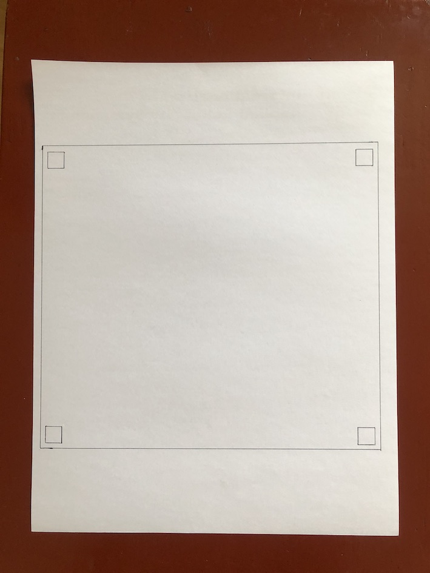

机缘巧合，最近跟着PyImage 的 Adrian的Blog，学习一些图像处理。。。其中我觉得比较有兴趣的一个方面是如何对照片中的图像进行[长宽的测量](https://www.pyimagesearch.com/2016/03/28/measuring-size-of-objects-in-an-image-with-opencv/?__s=yo68x506yucrfbb1gtj5)。

## 按照Adrian的理念是：

- 将标准的尺寸的物品放在最左边/最右边
    
- 拍照
    
- 将图中的物品的外形都找出来
    
- 用 标准尺寸物品 的 实际长宽 和 图中的 长宽 进行一个比较，得到ratio

- 对其他物品处理以类似的 ratio，以得到其实际长宽

## 自己的实操预期 及 没有料到的坑：

- 画一个矩形，然后在四个角上画上 10mm 的正方形
    
    - 完成，虽然不够完美

- 找出矩形四个点，并对其进行 [top-down_view](https://www.pyimagesearch.com/2014/09/01/build-kick-ass-mobile-document-scanner-just-5-minutes/)的处理
    
    - 正在处理坑 👈

- 对四个角上的正方形进行ratio比较，并做出ratio的计算

- 对放在这个框里的物品，进行长宽计算，并对结果做出error的计算

## 坑：铅笔的颜色太浅，不能找出矩形边界




## 坑：四角上的正方形涂色，但是没有办法找到最外面的四个角，找到的矩形的四个点，是以正方形靠内的四个点组成的，四个calibration的正方形没有被包含进去



## 坑3：



- 无法找出矩形的完整边框。。汗。。
    
    - 检查edged 图像，调整threshold

- 找出了差不多的框，可能是计算的area，有少许不同；另外导致这个问题的原因可能是因为框有的地方比较粗，所以因为是不同的框

    - ？看是否可以用面积difference 小于多少进行过滤 以及 坐标位置不同（因为有四个框的面积应该是差不多的，分别用于不同的定位点）。

## 预期的坑：

- 精度不够，因为拍照的位置的关系，可能有些地方会有拉长/ 缩短

## Wendy 的个人心得：

- 以下步骤对找出妥当的edge必不可少

    - 处理成gray，之后进行 GaussianBlur

    - 进行Canny 处理，注意设置妥当的threshold❗️

    - Adrian没有进行 edge dilate的处理，但是我发现，如果用我自己拍的图，为了找出妥当的边框，这一步不能少，也不排除是因为我拍的照片不够好

        ```py
        kernel = cv2.getStructuringElement(cv2.MORPH_ELLIPSE, (5, 5))
        edged = cv2.dilate(edged, kernel)
        ```

    - 有时找出来的框有问题，那就加上 put Text， 对每一个contour进行标识，或者一个一个的放contour，进行debug